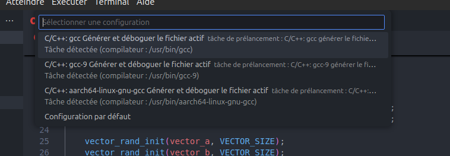

# Lab00 - Introduction to the environment

Follow the steps of the laboratory and complete the information

## Stage 2

Information about the CPU:

```bash
lscpu
```

* CPU Architecture:                     aarch64
* Number of cores:                      6
* On-line CPU(s) list:                  0-5
* Number of threads per core:           1
* Min frequency (MHz):                  115.2000
* Max frequency (MHz):                  1510.4000
* L1d cache:                            384 KiB
* L1i cache:                            384 KiB
* L2 cache:                             1.5 MiB

Information about L1d (data):

Source: https://stackoverflow.com/a/2795984
```bash
getconf -a | grep CACHE
```

* L1d cache line size: 64
* L1d cache associativity: 0

## Stage 5

According to the profiling information, what takes longer vector initialization or dot product?

```bash
gprof main

Flat profile:

Each sample counts as 0.01 seconds.
  %   cumulative   self              self     total           
 time   seconds   seconds    calls  ms/call  ms/call  name    
 83.33      0.05     0.05        1    50.00    50.00  vec_dot_prod
 16.67      0.06     0.01        2     5.00     5.00  vector_rand_init
```

**Answer:** The dot product takes longer than the initialization up to ~4x because it use de product of two values and the sum of the result, and the initialization of the vector is just a loop that assign a random value to each element of the vector.

What are the difference among the compilers sugested by Visual Studio Code when you debug for the first time?



**Answer:** 
In our case qe have juste 3 compilers, the first one is the default one that it executes `/usr/bin/gcc` with the default flags.and `-g` flag that is used to generate debugging information. 
The second one is the same as the first but with `gcc-9` instead of default `gcc`.
The third one is différent and it use `aaarch64-linux-gnu-gcc`. 

All of them doesn't use any optimization flags.

Difference beteween `gcc` and `aarch64-linux-gnu-gcc` is that the first one is used for x86 architecture and the second one is used for ARM architecture.