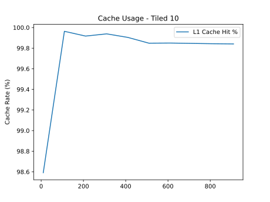
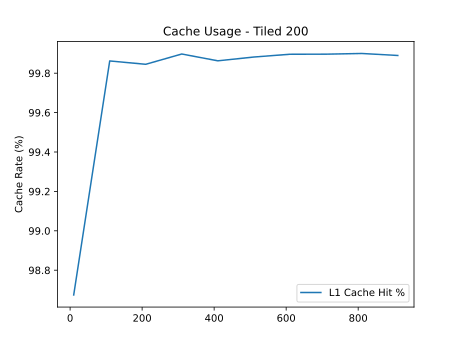

<style>
  legends {
    font-size: 0.8em;
    color: #333;
  }
</style>


# <center> Session n°1 {ignore=true}

# <center> Matrix multiplication optimization {ignore=true}

## <center>Departement : TIC {ignore=true}

## <center>CNM{ignore=true}

Author: **Andre Costa & Alexandre Iorio**

Professor: **Marina Zapater**

Assistant : **Mehdi Akeddar**

Classroom : **A09**

Date : **05.10.2024**

<!-- pagebreak -->

<!-- @import "[TOC]" {cmd="toc" depthFrom=2 depthTo=4 orderedList=false} -->

## Table des matières {ignore=true}

<!-- code_chunk_output -->

- [0. Preface](#0-preface)
- [1. Introduction](#1-introduction)
- [2. Material](#2-material)
- [3. Stage 1 - Understanding matrix memory layout and matrix multiplication](#3-stage-1---understanding-matrix-memory-layout-and-matrix-multiplication)
  - [3.1. Memory layout](#31-memory-layout)
  - [3.2. Matrix multiplication algorithm](#32-matrix-multiplication-algorithm)
- [4. Stage 2 - Source template and compiler flags](#4-stage-2---source-template-and-compiler-flags)
- [5. Stage 3 - Implementing general matrix multiplication](#5-stage-3---implementing-general-matrix-multiplication)
- [5.1 Stage 3 - Tests (Bonus)](#51-stage-3---tests-bonus)
- [6. Stage 4 - Measuring naïve matrix multiplication performance](#6-stage-4---measuring-naïve-matrix-multiplication-performance)
- [7. Stage 5 - Implementing tile square matrix multiplication](#7-stage-5---implementing-tile-square-matrix-multiplication)
- [7.1. Tests (Bonus)](#71-tests-bonus)
- [8. Stage 6 - Measuring tile square matrix multiplication performance](#8-stage-6---measuring-tile-square-matrix-multiplication-performance)
  - [8.1. Analysis of the performance measurements](#81-analysis-of-the-performance-measurements)
- [9. Conclusion](#9-conclusion)
- [10. Ref](#10-ref)

<!-- /code_chunk_output -->

<!-- pagebreak -->

## 0. Preface

This lab is written in Markdown format optimized for the interpreter used by the `Markdown Preview Enhanced` plugin of `Visual Studio Code`.

## 1. Introduction

The objective of this session is to explore and optimize the matrix multiplication algorithm.

We will analyze the cache memory behavior of the algorithm and optimize it using the tiling technique.

## 2. Material

To realize this laboratory, we will use the an `Nvidia® Jetson Orin Nano`.

To realize measurements, we will use the return of the `main` function and the `perf` command to measure the number of cache loads and misses for the general naive and tile implementation. To simplify the process, we will use a script to take measurements easily.

If you want to use the script, be sure that you have the `perf` command installed on your system.

In order to run the script, make sure you install the required libraries:

```sh
pip install -r requirements.txt
```

Here is the usage of `perf.py` script:

```sh
python3 perf.py -h
usage: perf.py [-h] -s START -e END -i INCREMENT [-t TILE] [-c] [-T]

Matrix multiplication performance script.

options:
  -h, --help            show this help message and exit
  -s START, --start START
                        Start matrix size.
  -e END, --end END     End matrix size.
  -i INCREMENT, --increment INCREMENT
                        Increment for matrix sizes.
  -t TILE, --tile TILE  Tile size for tiled multiplication.
  -c, --cache           Measure cache usage.
  -T, --time            Measure execution time.
  -S, --save            Save the plot as an SVG file.
  -F, --file            Name of the saved file.
```

## 3. Stage 1 - Understanding matrix memory layout and matrix multiplication

In this first part, we will analyze the data memory layout and the matrix multiplication algorithm.

### 3.1. Memory layout

The memory layout is an important aspect of the matrix multiplication algorithm.

Here we will be working with a `column-major` memory layout. Which means that the following `3 x 4` matrix:
$$ {Matrix} = \begin{bmatrix} 0 & 1 & 2 & 3 \\ 4 & 5 & 6 & 7 \\ 8 & 9 & 10 & 11 \end{bmatrix} $$

will be stored in memory like this:

$$ {Memory} = \begin{bmatrix} 0 & 4 & 8 & 1 & 5 & 9 & 2 & 6 & 10 & 3 & 7 & 11 \end{bmatrix} $$

### 3.2. Matrix multiplication algorithm

For a simple matrix $N \times N$ multiplication algorithm with range of data in row-major memory.

```c
void naive_square_matrix_multiplication(const int n, const double *matrix_a,
					const double *matrix_b,
					double *matrix_c)
{
	// row i of matrix_a
	for (int i = 0; i < n; ++i) {
		// column j of matrix_b
		for (int j = 0; j < n; ++j) {
			// calculate cij
			double cij = 0.0;

			for (int k = 0; k < n; ++k) {
				cij += matrix_a[i + k * n] *
				       matrix_b[k + j * n];
			}
			matrix_c[i + j * n] = cij;
		}
	}
}
```

## 4. Stage 2 - Source template and compiler flags

For this session, we will compile the code without any optimization flags.

```sh
gcc -O0 -o main main.c
```

In the next part of the lab, we will implement the general mutliplication algorthm which we can use to multiply two matrixes of different sizes.

<legends> source: CNM_lab01.etape1.pdf </legends>

The output of the code will be the time taken to execute the matrix multiplication algorithm in `seconds`.

## 5. Stage 3 - Implementing general matrix multiplication

The general matrix multiplication algorithm is a simple algorithm that multiplies two matrixes of different sizes.

Like we said previously, the matrixes are stored in memory in a column-major order.

In this stage, we will implement the general matrix multiplication algorithm to multiply two matrixes $A = M \times N$ and $B = N \times K$ to obtain the matrix $C = M \times K$.

$$ A \begin{bmatrix} a*{11} & a*{12} & \cdots & a*{1N} \\ a*{21} & a*{22} & \cdots & a*{2N} \\ \vdots & \vdots & \ddots & \vdots \\ a*{M1} & a*{M2} & \cdots & a*{MN} \end{bmatrix} \times B \begin{bmatrix} b*{11} & b*{12} & \cdots & b*{1K} \\ b*{21} & b*{22} & \cdots & b*{2K} \\ \vdots & \vdots & \ddots & \vdots \\ b*{N1} & b*{N2} & \cdots & b*{NK} \end{bmatrix} = C \begin{bmatrix} c*{11} & c*{12} & \cdots & c*{1K} \\ c*{21} & c*{22} & \cdots & c*{2K} \\ \vdots & \vdots & \ddots & \vdots \\ c*{M1} & c*{M2} & \cdots & c\_{MK} \end{bmatrix} $$

In order to realize this, here's an example using `M = 3`, `N = 4` and `K = 2`.


In order to multiply 2 matrix, we will have 3 loops.
First one will iterate over the rows of the first matrix, the second one will iterate over the columns of the second matrix and the last one will iterate over the columns of the first matrix and the rows of the second matrix.

So taking this into account, we can define three variables

- `i` to iterate over the rows of the first matrix.
  - `i ∈ [0, M[`
- `j` to iterate over the columns of the second matrix
  - `j ∈ [0, N[`
- `k` to iterate over the columns of the first matrix and the rows of the second matrix
  - `k ∈ [0, K[`

Calculating the index of the element in the matrix is a bit tricky. We need to take into account the column-major order of the matrix.

| i   | j   | k   | index_a | index_b | index_c |
| --- | --- | --- | ------- | ------- | ------- |
| 0   | 0   | 0   | 0       | 0       | 0       |
| 0   | 0   | 1   | 3       | 1       | 0       |
| 0   | 1   | 0   | 0       | 2       | 3       |
| 0   | 1   | 1   | 3       | 3       | 3       |
| 0   | 2   | 0   | 0       | 4       | 6       |
| 0   | 2   | 1   | 3       | 5       | 6       |
| 0   | 3   | 0   | 0       | 6       | 9       |
| 0   | 3   | 1   | 3       | 7       | 9       |
| ... | ... | ... | ...     | ...     | ...     |
| 2   | 0   | 0   | 2       | 0       | 2       |
| 2   | 0   | 1   | 5       | 1       | 2       |
| 2   | 1   | 0   | 2       | 2       | 5       |
| 2   | 1   | 1   | 5       | 3       | 5       |
| 2   | 2   | 0   | 2       | 4       | 8       |
| 2   | 2   | 1   | 5       | 5       | 8       |
| 2   | 3   | 0   | 2       | 6       | 11      |
| 2   | 3   | 1   | 5       | 7       | 11      |

With this information, we can deduce the following formula to calculate the index of the element in the matrix:

$$ {index_a} = i + k \times M $$
$$ {index_b} = k + j \times K $$
$$ {index_c} = n + j \times M $$

Putting this all together:

```c
void naive_matrix_multiplication(const double *matrix_a, const double *matrix_b,
				 double *matrix_c, const int M, const int N,
				 const int K)
{
	for (int i = 0; i < M; ++i) {
		for (int j = 0; j < N; ++j) {
			double sum = 0;
			for (int k = 0; k < K; ++k) {
				double ai = matrix_a[k * M + i];
				double bj = matrix_b[j * K + k];
				sum += ai * bj;
			}
			matrix_c[j * M + i] = sum;
		}
	}
}
```

With this function, the access to the matrix B is linear, but the access to matrix A and C are not.

We can see that inside the inner loop (k), we jump `M` elements to go to the next row of the matrix A. If the `M` value is big and the cache memory cannot contain all the elements of the matrix, we will have a lot of cache misses which will impact the performance of the algorithm.

## 5.1 Stage 3 - Tests (Bonus)

In order to test our implementation, we created a test function that will compare the result of the naive matrix multiplication with the result of an online matrix multiplication calculator.

This test can be found in [test.c](../src/test.c).

In order to run the test, you can use the following command:

```bash
gcc -o test test.c matrix.c
./test
```

This is also the reason we moved the function out of the main.c file and created a [matrix.c](../src/matrix.c) file.

## 6. Stage 4 - Measuring naïve matrix multiplication performance

Now that we have implemented the general matrix multiplication algorithm, we will measure the performance of the algorithm.

We can mesure the time taken to execute the matrix multiplication algorithm in `seconds`.

To measure the performance of the algorithm, we will use `perf.py` to run the code with different matrix sizes and tile sizes.

Here is the output of the script:

@import "../perf_plots/plot_start10_end500_inc1_naive.svg"

On the graph, we can see that the time taken to execute the algorithm is increasing exponentially with the matrix size.

## 7. Stage 5 - Implementing tile square matrix multiplication

In this stage, we will implement the tile square matrix multiplication algorithm.
This algorithm will divide the matrix into tiles and multiply the tiles to obtain the result matrix.


<legends> source: CNM_lab01.etape1.pdf </legends>

In order to do this, we will copy the two input tiles into a new matrix and multiply the two tiles to obtain the result tile.
We will do this until we have multiplied all the tiles in the row and column.

Here's an overview using a `6x6` matrix and a tile size of `2`.


After following the same steps as the general matrix, we were able to deduce the following algorithm that can be found in the [matrix.c](../src/matrix.c) file.

Since the code is a bit long, we will not put it here.

## 7.1. Tests (Bonus)

Like the naive implementation, we also created a test function that will compare the result of the tile matrix multiplication with the result of an online matrix multiplication calculator.

For this function we also added some edge cases:

- Tile size == 1
- Tile size a multiple of the matrix size
- Tile size not a multiple of the matrix size
- Tile size > matrix size

The test can be found in [test_tile.c](../src/test_tile.c).

In order to run the test, you can use the following command:

```bash
gcc -o test_tile test_tile.c matrix.c
./test_tile
```

To simplify the process of running tests, a bash script was created that runs all the tests

```bash
./test.sh

Naive Matrix Multiplication OK
Tile Matrix Multiplication (N = 6 Tile Size = 1) OK
Tile Matrix Multiplication (N = 6 Tile Size = 2) OK
Tile Matrix Multiplication (N = 6 Tile Size = 3) OK
Tile Matrix Multiplication (N = 6 Tile Size = 4) OK
Tile Matrix Multiplication (N = 6 Tile Size = 5) OK
Tile Matrix Multiplication (N = 6 Tile Size = 6) OK
Tile Matrix Multiplication (N = 6 Tile Size = 7) OK
```

## 8. Stage 6 - Measuring tile square matrix multiplication performance

Now that we have implemented the tile square matrix multiplication algorithm, we will measure the performance of the algorithm.

Let's execute the script on the Nvidia® Jetson Orin Nano to measure the performance of the algorithm with the same matrix sizes as [6. Stage 4 - Measuring naïve matrix multiplication performance](#6-stage-4---measuring-naïve-matrix-multiplication-performance) but with different tile sizes.

**Matrix from 10x10 to 500x500 incrementing by 10 with tile sizes from 1 to 500 incrementing with manual increments.**

<table border="1" cellpadding="10" cellspacing="0">
  <tbody>
    <tr>
      <td></td>
      <td></td>
      <td></td>
    </tr>
    <tr>
      <td></td>
      <td></td>
      <td></td>
    </tr>
    <tr>
      <td></td>
      <td></td>
      <td>
        <div>
        <table>
  <thead>
    <tr>
      <th>Tile size</th>
      <th>Time (s)</th>
    </tr>
  </thead>
  <tbody>
    <tr>
      <td>without tiling</td>
      <td>0.82</td>
    </tr>
    <tr>
      <td>2</td>
      <td>1.62</td>
    </tr>
    <tr>
      <td>4</td>
      <td>0.90</td>
    </tr>
    <tr>
      <td>10</td>
      <td>0.75</td>
    </tr>
    <tr>
      <td>20</td>
      <td>0.69</td>
    </tr>
    <tr>
      <td>50</td>
      <td>0.66</td>
    </tr>
    <tr>
      <td>100</td>
      <td>0.66</td>
    </tr>
    <tr>
      <td>200</td>
      <td>0.75</td>
    </tr>
  </tbody>
</table>
        </div>
      </td>
    </tr>
  </tbody>
</table>

With these results, we can say that if you use tiles with a certain size, you can optimize the cache memory behavior and reduce the time taken to execute the algorithm.

we can also see that we have almost the same time in a certain range of sizes. Take the exemple of the `200 Tiled Matrix` graph. between the size of `~120` and `~280`, the time taken to execute the algorithm is almost the same. It's because the cache memory behavior is optimized in this range of sizes. Then we have a gap between the size of `~280` and `~300` and again the time taken to execute the algorithm is almost the same until `~350`.

This `staircase` begin at the size of the tile.

But if you use a tile size too little or to big, you can have a negative impact on the cache memory behavior and increase the time taken to execute the algorithm.

### 8.1. Analysis of the performance measurements

From the results, we can see that the time taken to execute the algorithm is decreasing with the tile size from a certain point, then it increases again when the tile size is too big.

This behavior is explained by the fact that the cache memory hsa a certain size and the tile size must be adapted to this size to optimize the cache memory behavior.

On the `Nvidia® Jetson Orin Nano`, the cache memory size are:
| Cache | Size |
|-------|------|
| L1d | 384 KiB |
| L1i | 384 KiB |
| L2 | 1.5 MiB |
| L3 | 3 MiB |

regarding this command:

```sh
$ lscpu | grep -E 'L1d|L1i|L2|L3'
L1d cache:                            384 KiB
L1i cache:                            384 KiB
L2 cache:                             1.5 MiB
L3 cache:                             2 MiB

```

The matrix that we are using contains `double` values, which are `8 bytes` each. So, we can calculate the number of elements that we can store in the cache memory:
$$ {L1d*{elements}} = \frac{{CacheSize*{L1d}}}{SizeOf(double)} = \frac{384 \times 2^{10}}{8} = 49152 $$
$$ {L1d\_{Lines}} = \sqrt{49152} = 221 $$

To optimize the usage of the cache memory, we need to store the $Matrix_{A}$, $Matrix_{B}$ and $Matrix_{C}$ in the cache memory.

Then, we can calculate the number of elements by Matrix:

$$ {MatrixElements} = \frac{{L1d_{elements}}}{3} = 16384 $$

In this case, to calculate the tile size, we can use the square root of the number of elements in the matrix.
$$ {MatrixSize} = \sqrt{16384} = 128 $$

the size of a Matrix must be maximum of $128 \times 128$ elements each to optimize the cache memory behavior.

### 8.2. Analysis of L1 cache memory behavior with different tile sizes

Now that we know the size of the tile, we can compute a matrix and compare the time taken to execute the algorithm with the tile size of `128` and without tiling.

<table border="1" cellpadding="10" cellspacing="0">
  <tbody>
    <tr>
      <td></td>
      <td></td>
      <td></td>
    </tr>
    <tr>
      <td></td>
      <td></td>
      <td></td>
    </tr>
    <tr>
      <td></td>
      <td></td>
      <td></td>
    </tr>
  </tbody>
</table>

These results show that the `128 x 128` tile size is not the best size to optimize the cache memory behavior. We can't explaint why the `50 x 50` tile size is the best size to optimize the `L1` cache memory behavior.

## 9. Conclusion

In this session, we have implemented the general matrix multiplication algorithm and the tile square matrix multiplication algorithm.

We were able to see that the tiling technique can optimize the cache memory behavior and reduce the time taken to execute the algorithm.

With that said, we need to be smart in order to choose the right tile size if we wish to optimize the cache memory behavior. The tile size must be adapted to the cache memory size.

An idea that we haven't explored yet is the memory layout of the matrix. We believe that if we mix the `row-major` and `column-major` memory layout, we can further optimize the cache memory behavior.

## 10. Ref

- ChatGPT was used to help develop the `perf.py` script
