
---
author: Andrè Costa & Alexandre Iorio
date: 10.11.2024
title: Laboratoire n°2
title1: SIMD and NEON intrinsics
departement: TIC
course: unité d'enseignement CNM  
classroom: A09
professor: Marina Zapater
assistant: Mehdi Akeddar
toc-depth: 3
toc-title: Table des matières

--- 

## 0. Introduction

Dans ce laboratoire, nous allons appliquer du calcul matriciel en utilisant les instructions SIMD et NEON. Nous allons comparer les performances de calcul avec les laboratoires précédents.

## 1. Stage 2 - détection de contours

Dans cette partie, nous allons implémenter la détection de contours en utilisant les instructions SIMD et NEON et  

Afin de pouvoir utiliser les vecteurs de `int16x8_t` utilisé comme `kernel 3x3`, il faut admettre la valeur du centre du kernel à `0`.

Le principe est que pour chaque itération du kernel, on va créer un nouveau vecteur de `int16x8_t` avec les valeurs de l'image où se trouve le kernel pour pouvoir les multiplier en une opération et les accumuler dans un tableau 2D de la taille de l'image.

Les valeurs seront ensuite normalisées entre 0 et 255 pour pouvoir les afficher en tant qu'image de nuances de gris.

Voici le résultat de la détection de contours avec les instructions SIMD et NEON:

<table>
  <tr>
    <td>Originale</td>
    <td>Détection de bords horizontaux</td>
  </tr>
  <tr>
    <td></td>
    <td></td>
  </tr>
  <tr>
    <td>Détection de bords verticaux</td>
    <td>Détection de contours</td>
  </tr>
  <tr>
    <td>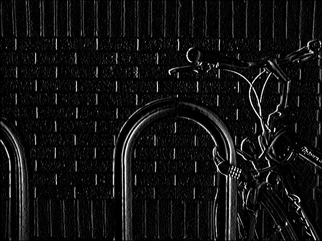 </td>
    <td>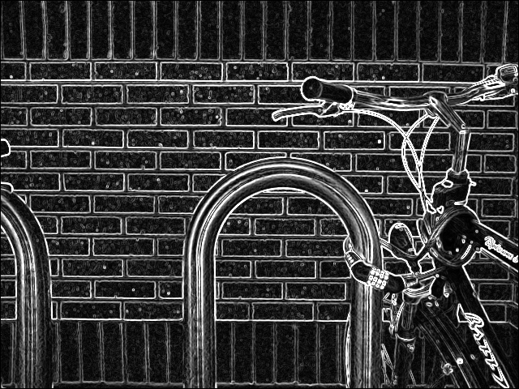</td>
  </tr>
</table>

<table>
  <tr>
    <td>Originale</td>
    <td>Détection de bords horizontaux</td>
  </tr>
  <tr>
    <td>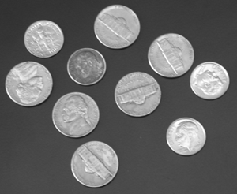</td>
    <td>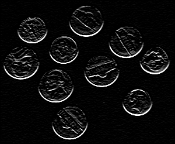</td>
  </tr>
  <tr>
    <td>Détection de bords verticaux</td>
    <td>Détection de contours</td>
  </tr>
  <tr>
    <td>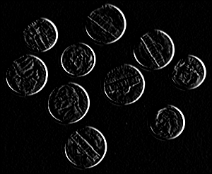 </td>
    <td>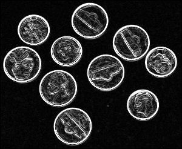</td>
  </tr>
</table>

<table>
  <tr>
    <td>Originale</td>
    <td>Détection de bords horizontaux</td>
  </tr>
  <tr>
    <td>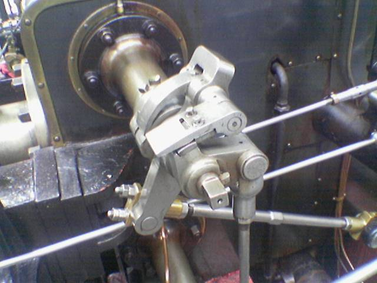</td>
    <td>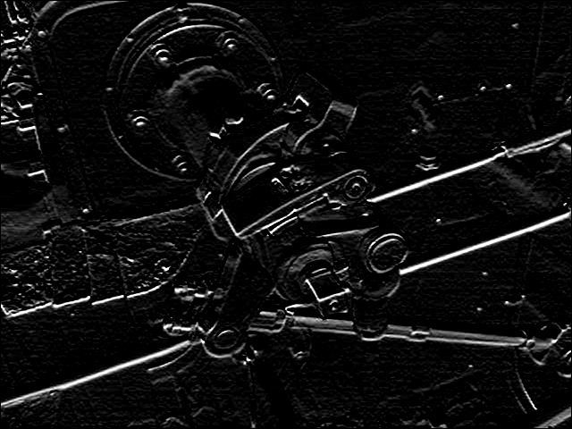</td>
  </tr>
  <tr>
    <td>Détection de bords verticaux</td>
    <td>Détection de contours</td>
  </tr>
  <tr>
    <td>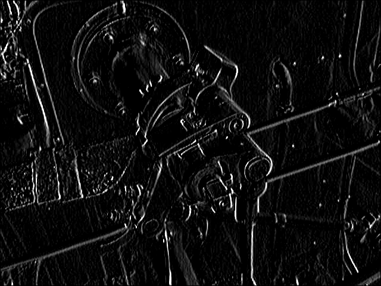 </td>
    <td>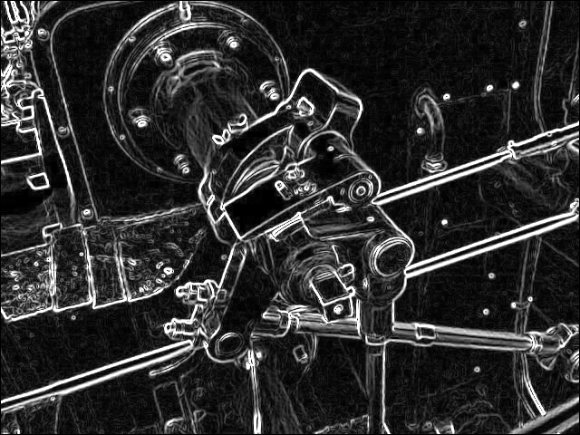</td>
  </tr>
</table>

## 2. Analyse des performances

Afin de comparer les performances de calcul entre les différentes implémentations des laboratoires précédents et l'implémentation SIMD. 

Voici les résultats obtenus:

<table style="width:85%">
  <tr>
    <td> 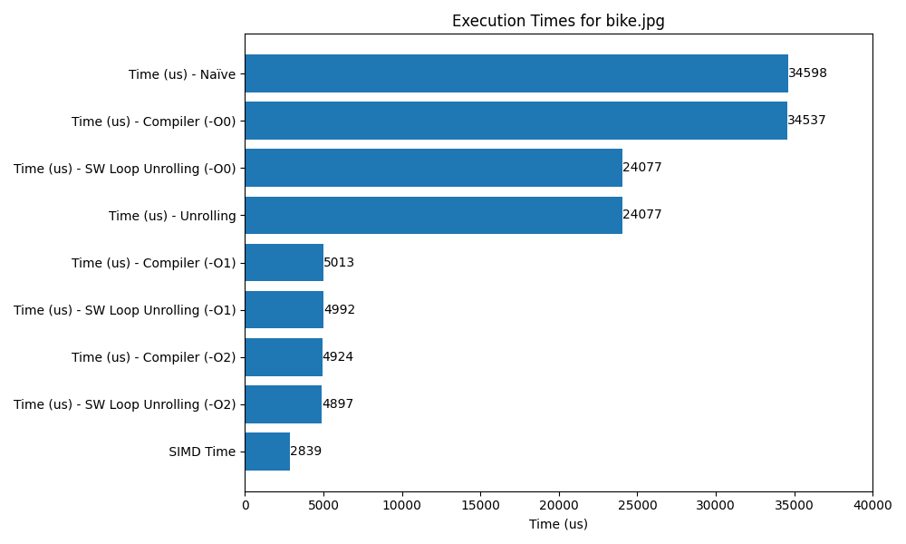 </td>
  </tr>
<tr>
    <td> 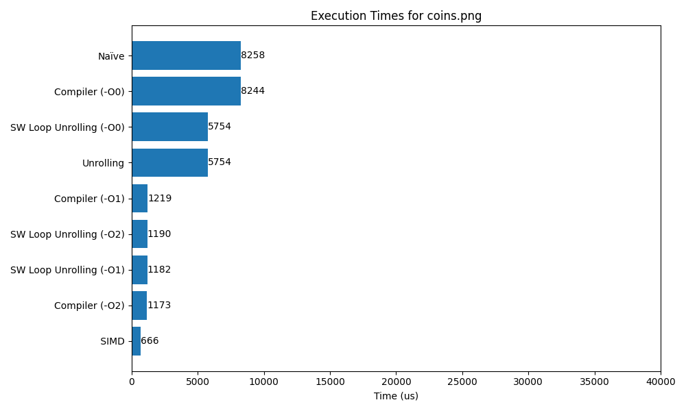 </td>
<tr>
    <td> 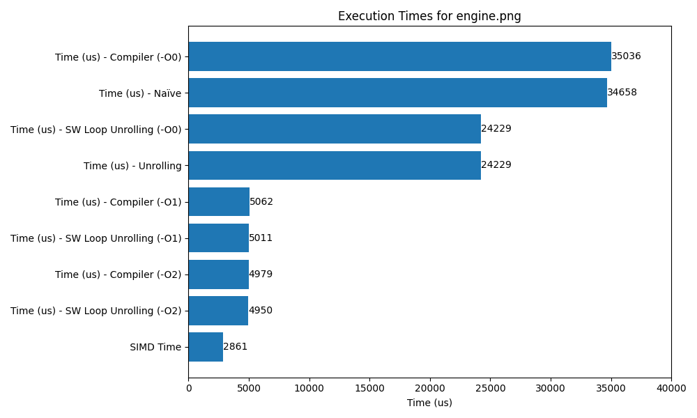 </td> 
  </tr>
</table>

On remarque que l'implémentation SIMD est plus rapide que les implémentations précédentes.

## 3. Conclusion

Dans ce laboratoire, nous avons implémenté la détection de contours en utilisant les instructions SIMD et NEON. Nous avons comparé les performances de calcul avec les laboratoires précédents et nous avons constaté que l'implémentation SIMD est plus rapide.

## 4. Réf

- ChatGPT pour la génération du script `chart.py`

