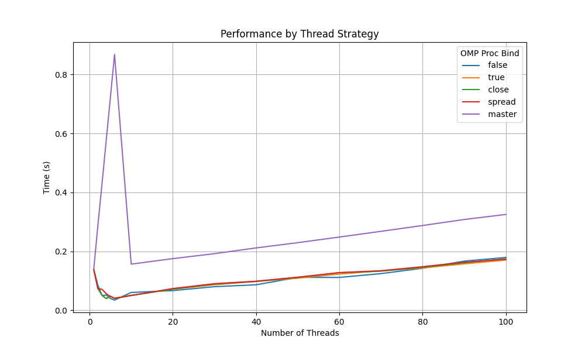
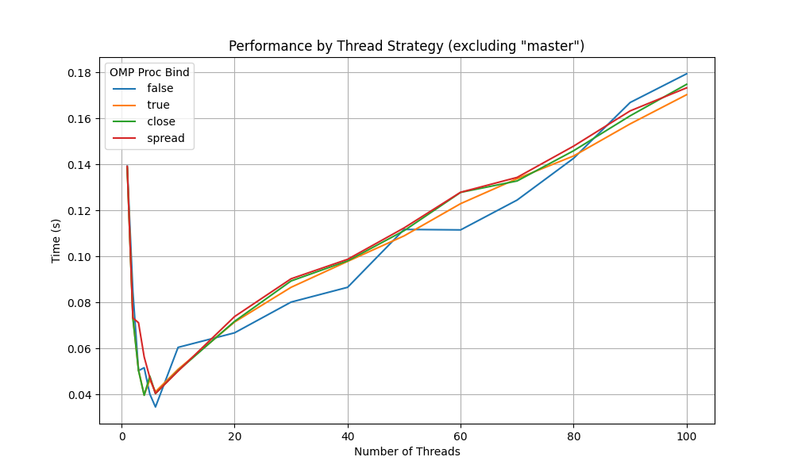

# Lab03 - Session 02 - Neural Networks and OpenMP

Follow the steps of the laboratory and complete the information

## Stage 2

What would happen if all the weights were initialized to 0 instead?

Answer: Le réseau de neurones apprendra toujours la même chose, car les minimas seront tous les mêmes.

## Stage 3

Provide examples of other activation functions that we could use in this context. 

Answer:
### ReLU (Rectified Linear Unit)
**Définition :**  
ReLU(x) = max(0, x)

**Utilisation :**  
- Couramment utilisée dans les réseaux neuronaux profonds.
- Simple et efficace pour le calcul des gradients.

---

### Tanh (Tangente Hyperbolique)
**Définition :**  
Tanh(x) = (e^x - e^(-x)) / (e^x + e^(-x))

**Utilisation :**  
- Produit des sorties centrées autour de 0, ce qui peut accélérer la convergence.

---

### Softmax
**Définition :**  
Softmax(xᵢ) = e^(xᵢ) / Σⱼ e^(xⱼ)

**Utilisation :**  
- Utilisée dans la couche de sortie pour les problèmes de classification.  
- Convertis un vecteur en probabilités normalisées (somme = 1).

---

### Leaky ReLU
**Définition :**  
Leaky ReLU(x) =  
- x, si x > 0  
- αx, sinon (où α est un petit nombre, par ex. 0.01)

**Utilisation :**  
- Version modifiée de ReLU qui atténue le problème des gradients nuls.


## Stage 5 - 6 

Where did you include the pragmas?

Train with/out openMP. Use different number of threads

|          |   time   |
|----------|----------|
| Baseline |0.091317s |
| openMP   |0.034336s | 


## Stage 7

Give an analysis of different places and binds combinations.

Afin d'analyser les différentes combinaisons de places et de binds, nous avons effectué plusieurs tests avec un nombre de Threads augmentant de 1 à 100. Nous avons tracé un graphique, le voici :


On remarque très clairement que, si l'on tente de rapprocher les Threads du `Master`, le temps d'exécution augmente et atteint son max avec 6 Threads.

|num_threads|omp_proc_bind|omp_places|time(s)|
|-----------|-------------|----------|-------|
|6          |master       |cores     |0.868147|

*Les résultats sont consultables dans results.csv*

Nous pouvons expliquer cela, car `Master` tente de rassembler les Threads sur le cœur où le Threads principal se trouve. Étant donné que nous avons 
un Threads par coeur cf: `lscpu`

```bash

cnm@cnm-desktop:~$ lscpu
Architecture:                         aarch64
CPU op-mode(s):                       32-bit, 64-bit
Byte Order:                           Little Endian
CPU(s):                               6   <-------
On-line CPU(s) list:                  0-5
Thread(s) per core:                   1   <-------
Core(s) per socket:                   3
```

Nous avons une concentration de 6 Threads sur un seul cœur en laissant les autres cœurs inutilisés. Cela a pour effet d'avoir une contention maximale.
Avec plus de Threads, la tâche est répartie sur plusieurs cœurs, ce qui améliore les performances.

Afin d'analyser au mieux les performances des autres combinaisons, nous avons recréé un graphique sans le `Master` :


Comme pour l'analyse précédente, on s'aperçoit qu'avec 6 Threads, les performances sont maximales. Cela est dû au fait que nous avons 6 cœurs sur la machine et que nous n’avons pas besoin de préempter les Threads sur d'autres cœurs.

Les courbes étant très proches, nous pouvons en déduire que les performances sont similaires, à l'exception de la combinaison `false` qui est moins linéaire que les autres. En effet, la désactivation de la liaison stricte des Threads à un cœur peut avoir un impact lors de la migration de ceux-ci vers les différents cœurs. 
