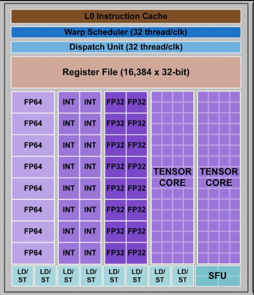

# Lab04 - Session 01 - Introduction to CUDA
Follow the steps of the laboratory and complete the information

## Stage 3

Fill the table with the information form the cabilities application

| Field                   | Value                 |
| ----------------------- | --------------------- |
| Device Name             | Orin                  |
| CUDA driver version     | 11.4                  |
| CUDA runtime version    | 11.4                  |
| CUDA Capability version | 8.7                   |
| Multiprocesors (MP)     | 8                     |
| CUDA cores/MP           | 128                   |
| Total CUDA cores        | 1024                  |
| GPU Max clock rate      | 624 MHz               |
| Global Memory           | 7451 MBytes           |
| Shared memory/block     | 49152 bytes           |
| Registers/block         | 65536                 |
| L2 Cache size           | 2097152 bytes         |
| Warp size               | 32                    |
| Max threads/block       | 1024                  |
| Max dim thread block    | x: 1024, y:1024, z:64 |

Answer these questions using the [CUDA C++ programming guide](https://docs.nvidia.com/cuda/cuda-c-programming-guide/index.html).

* What is a Streaming multiprocesor?

Un `SM` contient plusieurs "coeurs" qui permettent d'executer des opération arithmetiques, de la mémoire partagée.


* What is a wrap?

Un wrap est un groupe de thread qui sont éxécuté en même temps. 32 pour la jetson. Ils partagent tous la meme instruction mais peuvent traiter des données différentes.

* What is a block?
c'est un groupe de thread qui s'exécutent ensemble et qui partagent des ressources. Un block peut contenir jusqu'à 1024 threads mais seulement 32(warp) threads peuvent être exécutés en même temps.

* What is a grid?
Une grille constitue simplement un groupe de block. C'est ce qui permet d'exploiter le parralelisme massif de la carte graphique avec des structure 1D, 2D ou 3D. Il peuvent seulement partager des informations via la mémoire globale. 

## Stage 4

Answer these questions searching in the source code.

**What specifier is used in the function "vectorAdd" to declare it as CUDA kernel?**

Le spécificateur utilisé est `__global__`, indiquant que la fonction est un kernel exécuté sur le GPU et appelé depuis le CPU.

**How many threads per block is it using?**

La valeur de `threadsPerBlock` est 256.

**How many blocks are used in total?**

```C
blocksPerGrid = (numElements + threadsPerBlock - 1) / threadsPerBlock;
```

c.à.d. 

Avec `numElements` = 50000 et `threadsPerBlock` = 256, cela donne :
`blocksPerGrid` = `ceil(50000 / 256)` = 196.

**How many threads are used in total?**

`threadsPerBlock` * `blocksPerGrid` = 256 * 196 = 50176.

Seul 50'000 threads sont utilisés en raison de la taille du vecteur.


**What function is used to allocate memory in the device? and to free memory in the device?**

- Allocation de mémoire avec: `cudaMalloc`.
- Libération de mémoire avec: `cudaFree`.

**What function is used to copy memory from the host to the device? and from the device to the host?**
- Copie de la mémoire de l’hôte vers le périphérique avec `cudaMemcpy` et `cudaMemcpyHostToDevice` en argument.
- Copie de la mémoire du périphérique vers l’hôte avec `cudaMemcpy` et `cudaMemcpyDeviceToHost` en argument.


## Stage 4&5 

Provide the timeline graph of your application, and a 2-3 sentences analysis of what's happening during the run. For example, you could answer the following questions:

**From the GPU activities, how much percentage of GPU time is use to perform the actual vector addition?**

| Time (%) | Total Time (ns) | Instances | Avg (ns)  | Med (ns)  | Min (ns) | Max (ns) | StdDev (ns) | Name                                                      |
|----------|-----------------|-----------|-----------|-----------|----------|----------|-------------|-----------------------------------------------------------|
| 100.0    | 25’056          | 1         | 25’056.0  | 25’056.0  | 25’056   | 25’056   | 0.0         | vectorAdd(const float *, const float *, float *, int)     |

Avec ce tableau, on peut voir que 100% du temps d'exécution est consacré à la fonction `vectorAdd`. Cela signifie que le GPU est utilisé à 100% pour effectuer l'addition de vecteurs.

**From the API calls, What it is the funtion that consume more time?**

| Time (%) | Total Time (ns) | Num Calls | Avg (ns)     | Med (ns)    | Min (ns) | Max (ns)     | StdDev (ns)     | Name              |
|----------|-----------------|-----------|--------------|-------------|----------|--------------|-----------------|-------------------|
| 98.8     | 220’092’864     | 3         | 73’364’288.0 | 12’384.0    | 5’536    | 220’074’944  | 127’055’155.1  | cudaMalloc        |
| 1.0      | 2’268’608       | 3         | 756’202.7    | 1’064’064.0 | 118’752  | 1’085’792    | 552’155.4       | cudaMemcpy        |
| 0.1      | 245’088         | 3         | 81’696.0     | 18’144.0    | 8’032    | 218’912      | 118’940.1       | cudaFree          |
| 0.0      | 76’256          | 1         | 76’256.0     | 76’256.0    | 76’256   | 76’256       | 0.0             | cudaLaunchKernel  |

Le tableau montre que la fonction `cudaMalloc` consomme 98.8% du temps d'exécution. Cela signifie que la majorité du temps est consacré à l'allocation de mémoire sur le GPU.

