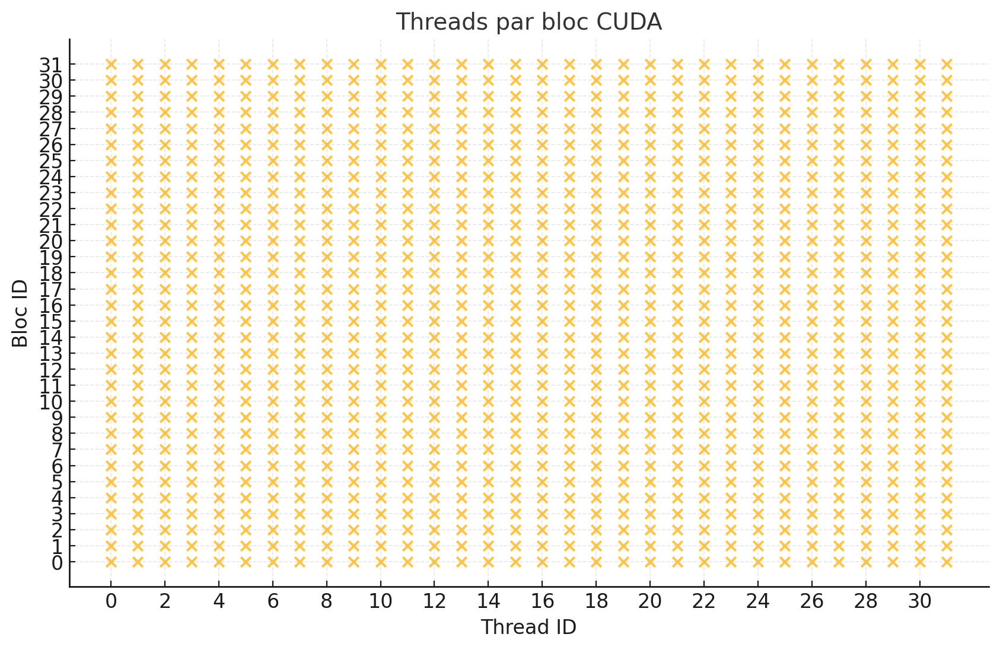

# Lab 04 - Session 02

## Stage 2

* Write an example of kernel execution configuration with **block and grid dimensions** bigger that 1. 

```c++
    //Kernel execution configuration example
    kernel<<<32, 32>>>()
```

Voici une partie de l'output:

```bash

Thread 0/32 in 6/32
Thread 1/32 in 6/32
Thread 2/32 in 6/32
Thread 3/32 in 6/32
Thread 4/32 in 6/32
Thread 5/32 in 6/32
Thread 6/32 in 6/32
Thread 7/32 in 6/32
Thread 8/32 in 6/32
Thread 9/32 in 6/32
Thread 10/32 in 6/32
Thread 11/32 in 6/32
Thread 12/32 in 6/32
Thread 13/32 in 6/32
Thread 14/32 in 6/32
Thread 15/32 in 6/32
Thread 16/32 in 6/32
Thread 17/32 in 6/32
...
...
Thread 24/32 in 28/32
Thread 25/32 in 28/32
Thread 26/32 in 28/32
Thread 27/32 in 28/32
Thread 28/32 in 28/32
Thread 29/32 in 28/32
Thread 30/32 in 28/32
Thread 31/32 in 28/32

``` 

afin de visualiser correctement l'utilisation des threads, voici une representation graphique:



**How many threads in total will be used with your execution configuration?**

32 x 32 = 1024

## Stage 3

** What happens when use the following execution configuration? Why?**

```c++    
    scalar_multiplication<<<4000, 256>>>(n, a, x ,y, z)
    // Where:
    //   n is the vector size
    //   a is the scalar
    //   x,y,z are device vector pointers    
```

Le programme se lance avec succés car le nombre de blocs est inférieur à 65536 et que le nombre de threads par bloc est inférieur à 1024.

**What happens when we use the following execution configuration? Why?**

```c++    
    scalar_multiplication<<<1024, 2048>>>(n, a, x ,y, z)
    // Where:
    //   n is the vector size
    //   a is the scalar
    //   x,y,z are device vector pointers    
```

Ici ca ne fonctionne pas car le nombre de threads par bloc est supérieur à 1024. 

**What happens when we use the following execution configuration? Why?**

```c++    
    scalar_multiplication<<<{64,64}, 256>>>(n, a, x ,y, z)
    // Where:
    //   n is the vector size
    //   a is the scalar
    //   x,y,z are device vector pointers    
```

Dans ce cas, nous avons une grille de 64 x 64 ce qui nous donne un total de 4096 blocs. Cela fonctionne pour les memes raisons que le premier exemple.

## Stage 4

* How long does the cpu gemm take? and in CUDA? How much is the speed up?

avec `n = 512`, `m = 512` et `p = 512`:

```bash
cnm@cnm-desktop:~/cnm/lab04_session02_cuda_thread_hierarchy$ ./gemm 
Running GEMM in CPU...
Complete GEMM in CPU in 847.718 ms
Checking CPU GEMM: Success
Complete GEMM in GPU in 5.792 ms (with cuda event)
Checking GPU GEMM: Success
``` 

Le calcul sur GPU est appriximativement `146` fois plus rapide que sur CPU.

* Now, double the size of *n*, *m* and *p*. How long does the cpu gemm take? and in CUDA? How much is the speed up?

avec `n = 1024`, `m = 1024` et `p = 1024`:

```bash
cnm@cnm-desktop:~/cnm/lab04_session02_cuda_thread_hierarchy$ ./gemm 
Running GEMM in CPU...
Complete GEMM in CPU in 6767.147 ms
Checking CPU GEMM: Success
Complete GEMM in GPU in 44.684 ms (with cuda event)
Checking GPU GEMM: Success
```

Le calcul sur GPU est appriximativement `151` fois plus rapide que sur CPU.