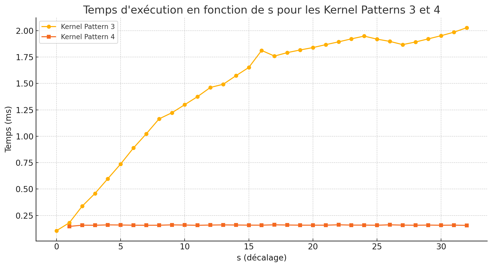

# Lab 04 - Session 03

## Stage 2

Which statements have coalessed accesss pattern? Explain answers
```c++
__global__ void aux(float *a, int s)
{
    float e = 2.71828;
    int   i = blockDim.x * blockIdx.x + threadIdx.x;    
    ...
```

1. `a[i] = e;` OUI

2. `e = a[i];` OUI

4. `a[i+s] = e;` OUI (dépend de la valeur de `s` s'il en résulte un alignement) 

3. `a[i*s] = e;` OUI si `s == 1` sinon NON


Implement the kernel for number 3 and number 4 and measure the time it takes to complete different executions using different values of `s`. Comment the results.



Voici le graphe représentant le temps d'exécution en fonction du décalage `s` pour les Kernel Patterns 3 et 4 :

Kernel Pattern 3 : On observe une augmentation progressive du temps d'exécution avec `s` en raison de la `sparsité`.

Kernel Pattern 4 : Le temps reste relativement constant, la dépendence à `s` est moindre.

## Stage 3

**How many times do you read each matrix from global memory in the shared memory implementation?**
avec une matrice de taille 
**How long does the gpu gemm with shared memory take?** 
**Now, double the size of *n*, *m* and *p*. How long does it take now?**

Compare with the results obtained in the previous lab

## Stage 4

**Does the original increment kernel produce the correct result? Why?**
**How much time does the original increment kernel take?**
**How much time does the increment kernel with atomics take? Does it take more or less time than the original kernel? Why?**

 
## Stage 5.1
- Performance (speedup) comparison between `simple_gemm` and `cublasSgem`

### Stage 5.1 questions
- What cuBLAS datatype is used for function status returns?
- What does `cublasCreate` do? What data type does is use?
- What cuBLAS methods do we use to copy data from host to GPU? and from GPU to host?
- What matrix memory layout (row-oriented or column-oriented) is assumed in `simple_gemm()`?
- What is the matrix memory layout expected by `cublasSgemm()`?

## Stage 5.2

- What is the network topology?
- What method do we use to create a cuDNN context? What datatype does it use?
- What data type do we use to describe a tensor (a multidimensional array)? What method do we use to create an instance of a tensor descriptor? What method do we use to initalize a multidemsional tensor descriptor?